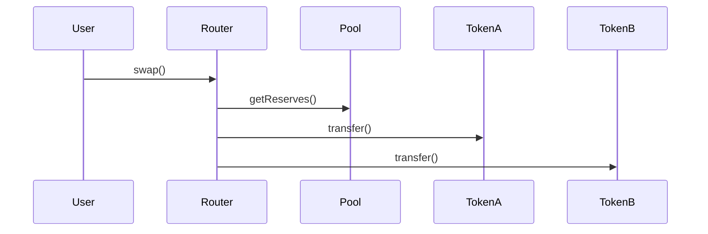

# txray Improvement Ideas

A comprehensive list of code improvements, features, and architectural enhancements.

---

## 1. Architecture & Code Quality

### 1.1 Add TypeScript Strict Mode
**Priority: High**

Currently no `tsconfig.json` exists. Add one with strict settings:
```json
{
  "compilerOptions": {
    "strict": true,
    "noUncheckedIndexedAccess": true,
    "noImplicitOverride": true
  }
}
```

### 1.2 Extract Input Parsing to Dedicated Module
**Priority: Medium**

`src/cli.ts` mixes input parsing with orchestration. Extract to `src/input.ts`:
```typescript
// src/input.ts
export type ParsedInput = 
  | { type: 'url'; txHash: Hex; chainId: number; network: NetworkConfig }
  | { type: 'hash'; txHash: Hex; chainId: number };

export function parseInput(args: string[]): ParsedInput { ... }
```

### 1.3 Dependency Injection for Testing
**Priority: Medium**

`debugTransaction` creates its own `PublicClient`. Accept it as a parameter for easier mocking:
```typescript
export async function debugTransaction(
  network: NetworkConfig,
  txHash: Hex,
  client?: PublicClient  // Optional override for testing
): Promise<DebugResult>
```

### 1.4 Plugin Architecture for Output Formatters
**Priority: Low**

Allow custom output formatters:
```typescript
interface OutputFormatter {
  format(result: DebugResult): string;
}
// Built-in: TextFormatter, JsonFormatter, MarkdownFormatter
```

---

## 2. Error Handling

### 2.1 Wrap ABI Loading in Try/Catch
**Priority: High**

`src/abis.ts` will crash with raw stack trace if:
- `abi/` directory is missing
- Any ABI file has syntax errors

```typescript
// src/abis.ts
for (const file of files) {
  try {
    const mod = await import(join(abiDir, file));
    // ... merge logic
  } catch (err) {
    console.warn(`Warning: Failed to load ABI from ${file}: ${err.message}`);
  }
}
```

### 2.2 Better RPC Error Messages
**Priority: High**

Current RPC errors from viem are cryptic. Catch and rephrase common failures:
```typescript
try {
  const [tx, receipt] = await Promise.all([...]);
} catch (err) {
  if (err.message.includes('not found')) {
    throw new Error(`Transaction not found. It may be pending or on a different chain.`);
  }
  if (err.message.includes('429') || err.message.includes('rate')) {
    throw new Error(`RPC rate limited. Try again in a few seconds.`);
  }
  throw err;
}
```

### 2.3 Custom Error Classes
**Priority: Low**

Create typed errors for better programmatic handling:
```typescript
export class TxNotFoundError extends Error { ... }
export class UnsupportedNetworkError extends Error { ... }
export class AbiDecodingError extends Error { ... }
```

### 2.4 Validate `abi/` Directory Exists at Startup
**Priority: Medium**

Check before `readdirSync` to provide a clear error message:
```typescript
if (!existsSync(abiDir)) {
  console.warn(`Warning: ABI directory not found at ${abiDir}. No custom ABIs will be loaded.`);
}
```

---

## 3. CLI UX Improvements

### 3.1 Add `--help` and `--version` Flags
**Priority: High**

Standard CLI flags are expected but missing:
```typescript
if (args.includes('--help') || args.includes('-h')) {
  printUsage();
  process.exit(0);
}
if (args.includes('--version') || args.includes('-v')) {
  console.log(pkg.version);
  process.exit(0);
}
```

### 3.2 Add `--json` Output Format
**Priority: High**

Enable machine-readable output for piping/scripting:
```bash
txray https://etherscan.io/tx/0x... --json | jq '.logs[0]'
```

### 3.3 Add `--quiet` / `--verbose` Modes
**Priority: Medium**

- `--quiet`: Only show errors and status
- `--verbose`: Show raw RPC responses, full topic hashes, etc.

### 3.4 Add Loading Spinner/Progress
**Priority: Medium**

RPC calls can be slow. Show progress:
```typescript
import ora from 'ora';
const spinner = ora('Fetching transaction...').start();
// ... fetch
spinner.succeed('Transaction loaded');
```

### 3.5 Support stdin for Batch Processing
**Priority: Low**

```bash
cat tx-hashes.txt | txray --stdin
```

### 3.6 Add Shell Completions
**Priority: Low**

Generate bash/zsh/fish completions for network names and flags.

### 3.7 Config File Support
**Priority: Medium**

Support `~/.txrayrc` or `.txrayrc.json` for:
- Default chain ID
- Custom RPC URLs per network
- Preferred output format
- Custom address labels

### 3.8 Clipboard Support
**Priority: Low**

```bash
txray --clipboard  # Read tx hash from clipboard
txray ... --copy   # Copy result to clipboard
```

---

## 4. Core Features - Tracing & Debugging

### 4.1 Call Trace Support (debug_traceTransaction)
**Priority: High**

Add deep call tracing using `callTracer`:
```bash
txray https://etherscan.io/tx/0x... --trace
```

Output:
```
Call Trace:
├─ [CALL] 0x7a25...Router.swap(...)
│  ├─ [STATICCALL] 0x1234...Pool.getReserves()
│  ├─ [CALL] 0x5678...Token.transfer(to=0xabc..., amount=1000000)
│  │  └─ [LOG] Transfer(from, to, amount)
│  └─ [CALL] 0x9abc...Token.transfer(...)
└─ [RETURN] success
```

### 4.2 Interactive TUI Debugger
**Priority: High**

Step-through debugger like `cast run --debug`:
```bash
txray https://etherscan.io/tx/0x... --debug
```

Features:
- Opcode-by-opcode stepping
- Stack/memory/storage view
- Jump to source (if available)
- Keyboard navigation (n=next, s=step-into, q=quit)

### 4.3 State Diff Analysis
**Priority: High**

Show storage changes before/after:
```bash
txray https://etherscan.io/tx/0x... --state-diff
```

Output:
```
State Changes:
┌─────────────────────────────────────────────────────────────────────┐
│ Contract: 0x1234... (USDC)                                          │
├─────────────────────────────────────────────────────────────────────┤
│ _balances[0xabc...]: 1000000 → 500000  (-500000)                    │
│ _balances[0xdef...]: 0 → 500000        (+500000)                    │
└─────────────────────────────────────────────────────────────────────┘
```

### 4.4 Prestate Tracer Support
**Priority: Medium**

Show account state before execution:
```bash
txray https://etherscan.io/tx/0x... --prestate
```

### 4.5 Internal Function Decoding
**Priority: Medium**

Decode internal function calls (not just cross-contract):
```bash
txray https://etherscan.io/tx/0x... --trace --decode-internal
```

Requires local artifacts or debug info.

---

## 5. Core Features - Analysis

### 5.1 Gas Analysis & Profiling
**Priority: High**

Show gas breakdown per call:
```bash
txray https://etherscan.io/tx/0x... --gas
```

Output:
```
Gas Analysis:
┌──────────────────────────────────────────────────────────────┐
│ Total Gas Used: 245,000                                       │
├──────────────────────────────────────────────────────────────┤
│ Base Fee:           21,000  (8.6%)                           │
│ Calldata:            5,600  (2.3%)                           │
│ Execution:         218,400  (89.1%)                          │
├──────────────────────────────────────────────────────────────┤
│ Top Gas Consumers:                                            │
│   1. Router.swap()           180,000  (73.5%)                │
│   2. Token.transfer()         25,000  (10.2%)                │
│   3. Pool.sync()              13,400  (5.5%)                 │
└──────────────────────────────────────────────────────────────┘
```

### 5.2 Gas Flame Graph (ASCII)
**Priority: Medium**

Text-based flame graph:
```bash
txray https://etherscan.io/tx/0x... --flame
```

Output:
```
Gas Flame Graph:
[##################################################] swap() 180k
[##########                                        ] transfer() 25k
[#####                                             ] sync() 13k
```

### 5.3 Fund Flow / Token Transfer Summary
**Priority: High**

Track all token movements:
```bash
txray https://etherscan.io/tx/0x... --flow
```

Output:
```
Fund Flow:
┌─────────────┬─────────────┬─────────────┬──────────────────┐
│ From        │ To          │ Token       │ Amount           │
├─────────────┼─────────────┼─────────────┼──────────────────┤
│ 0xabc...    │ 0xdef...    │ USDC        │ +500.00          │
│ 0xdef...    │ 0x123...    │ WETH        │ +0.25            │
│ 0xabc...    │ Router      │ ETH         │ -0.5             │
└─────────────┴─────────────┴─────────────┴──────────────────┘

Net Balance Changes:
  0xabc...: -500 USDC, -0.5 ETH
  0xdef...: +500 USDC, -0.25 WETH
  0x123...: +0.25 WETH
```

### 5.4 Profit/Loss Calculator
**Priority: Medium**

For MEV/arbitrage transactions:
```bash
txray https://etherscan.io/tx/0x... --pnl
```

Output:
```
Profit/Loss Analysis:
  Input:  0.5 ETH ($1,250)
  Output: 0.52 ETH ($1,300)
  Gas:    0.005 ETH ($12.50)
  ─────────────────────────
  Net P/L: +0.015 ETH (+$37.50)
```

---

## 6. Core Features - Simulation

### 6.1 Transaction Simulation (eth_call)
**Priority: High**

Simulate a transaction without broadcasting:
```bash
txray simulate --from 0x... --to 0x... --data 0x... --value 1ether --chain 1
```

### 6.2 Replay with State Overrides
**Priority: Medium**

Re-run a historical transaction with modifications:
```bash
txray replay 0xabc... --override-balance 0x123...=100ether
txray replay 0xabc... --override-storage 0x123...:slot0=0x1
txray replay 0xabc... --as 0xwhale...  # Impersonate different sender
```

### 6.3 "What If" Analysis
**Priority: Medium**

Test alternative parameters:
```bash
txray whatif 0xabc... --gas-price 50gwei  # Would it have succeeded?
txray whatif 0xabc... --block 18000000    # At a different block?
```

### 6.4 Pending Transaction Analysis
**Priority: Low**

Analyze mempool transactions:
```bash
txray pending 0xabc...  # Simulate pending tx
txray watch 0xabc...    # Watch until confirmed
```

---

## 7. Core Features - Contract Intelligence

### 7.1 Contract Source Display
**Priority: Medium**

Fetch verified source from Etherscan/Sourcify:
```bash
txray https://etherscan.io/tx/0x... --source
```

Output:
```
Contract: 0x1234... (Uniswap V3 Router)
Function: exactInputSingle((address,address,uint24,address,uint256,uint256,uint160))

Source (line 142-158):
│ 142 │ function exactInputSingle(ExactInputSingleParams calldata params)
│ 143 │     external payable override returns (uint256 amountOut) {
│ 144 │     amountOut = exactInputInternal(...);
│ 145 │ }
```

### 7.2 ABI Auto-Fetch from Etherscan
**Priority: Medium**

Automatically fetch ABIs for verified contracts:
```bash
txray https://etherscan.io/tx/0x... --fetch-abi
```

### 7.3 Decompilation for Unverified Contracts
**Priority: Low**

Integration with Heimdall/Panoramix:
```bash
txray https://etherscan.io/tx/0x... --decompile
```

### 7.4 Proxy Detection & Resolution
**Priority: Medium**

Automatically detect and resolve proxy contracts:
```
To: 0x1234... (Proxy)
  └─ Implementation: 0x5678... (UniswapV3Pool)
```

### 7.5 Storage Layout Decoding
**Priority: Low**

Decode storage slots to variable names:
```bash
txray storage 0x1234... --slot 0x0
# Output: _owner: 0xabc...
```

---

## 8. Core Features - Identity & Labels

### 8.1 ENS Resolution
**Priority: Medium**

Resolve ENS names in output:
```
From: 0xd8dA6BF26964aF9D7eEd9e03E53415D37aA96045 (vitalik.eth)
```

### 8.2 Custom Address Labels
**Priority: Medium**

Support labels file:
```bash
txray https://etherscan.io/tx/0x... --labels ./labels.json
```

`labels.json`:
```json
{
  "0x1234...": "My Wallet",
  "0x5678...": "Team Multisig"
}
```

### 8.3 Auto-Label Known Contracts
**Priority: Medium**

Expand `known.ts` with more protocols:
- All major DEXes (Uniswap, Sushi, Curve, Balancer)
- Lending protocols (Aave, Compound, Maker)
- Bridges (Across, Stargate, Hop)
- NFT marketplaces (OpenSea, Blur, LooksRare)

### 8.4 Contract Name from Bytecode Signature
**Priority: Low**

Match bytecode against known signatures:
```
To: 0x1234... (Unknown - matches Gnosis Safe pattern)
```

---

## 9. Output Formats

### 9.1 Markdown Export
**Priority: Low**

```bash
txray https://etherscan.io/tx/0x... --markdown > report.md
```

### 9.2 HTML Report
**Priority: Low**

Generate standalone HTML report:
```bash
txray https://etherscan.io/tx/0x... --html > report.html
```

### 9.3 Mermaid Diagram Export
**Priority: Low**

Generate call flow diagram:
```bash
txray https://etherscan.io/tx/0x... --mermaid
```

Output:


### 9.4 CSV Export for Transfers
**Priority: Low**

```bash
txray https://etherscan.io/tx/0x... --transfers --csv > transfers.csv
```

---

## 10. Subcommands

### 10.1 `txray decode` - Decode Calldata
**Priority: Medium**

```bash
txray decode 0xa9059cbb000000... --abi ./erc20.json
# Output: transfer(to=0x123..., amount=1000000)
```

### 10.2 `txray abi` - ABI Management
**Priority: Low**

```bash
txray abi add 0x1234... --chain 1        # Fetch from Etherscan
txray abi add ./mycontract.json          # Add local ABI
txray abi list                            # List loaded ABIs
txray abi search "transfer"               # Search functions
```

### 10.3 `txray block` - Block Analysis
**Priority: Low**

```bash
txray block 18000000 --chain 1
# Shows all transactions in block with quick summary
```

### 10.4 `txray address` - Address Analysis
**Priority: Low**

```bash
txray address 0x1234... --chain 1
# Shows: contract/EOA, balance, recent txs, labels
```

### 10.5 `txray compare` - Diff Two Transactions
**Priority: Low**

```bash
txray compare 0xabc... 0xdef...
# Shows differences in calls, events, state changes
```

### 10.6 `txray receipt` - Quick Receipt View
**Priority: Low**

```bash
txray receipt 0xabc...
# Minimal output: status, gas, block, logs count
```

---

## 11. Testing

### 11.1 Add Unit Tests
**Priority: High**

Currently **zero tests**. Add tests for:
- `parseExplorerUrl()` with various URLs
- `decodeAllLogs()` with known logs
- `tryDecodeError()` with various error formats
- `formatValue()` with edge cases

### 11.2 Add Integration Tests
**Priority: Medium**

Test full flow with recorded RPC responses (using `msw` or similar):
```typescript
test('debugs mainnet transaction', async () => {
  // Mock RPC responses
  const result = await debugTransaction(mainnet, '0x...');
  expect(result.status).toBe('success');
  expect(result.logs).toHaveLength(5);
});
```

### 11.3 Add Snapshot Tests for Output
**Priority: Medium**

Ensure `formatDebugResult` output doesn't regress:
```typescript
expect(formatDebugResult(knownResult)).toMatchSnapshot();
```

### 11.4 Add CI Pipeline
**Priority: Medium**

GitHub Actions workflow for:
- Type checking
- Linting
- Tests
- Build verification

### 11.5 Golden File Tests
**Priority: Medium**

Store expected outputs for known transactions:
```
tests/fixtures/
  mainnet-simple-transfer.json
  mainnet-uniswap-swap.json
  polygon-failed-tx.json
```

---

## 12. Code Improvements

### 12.1 `formatDebugResult` is Too Long (60+ lines)
**Priority: Medium**

Split into smaller functions:
```typescript
function formatHeader(result: DebugResult): string[]
function formatTransactionInfo(result: DebugResult): string[]
function formatErrors(errors: DecodedError[]): string[]
function formatLogs(logs: DecodedLog[]): string[]
function formatLinks(links: DebugResult['links']): string[]
```

### 12.2 Magic Numbers Should Be Constants
**Priority: Low**

```typescript
// Before
if (value > 10n ** 15n && value < 10n ** 30n) { ... }
const hr = pc.dim('─'.repeat(70));

// After
const MIN_TOKEN_VALUE = 10n ** 15n;
const MAX_TOKEN_VALUE = 10n ** 30n;
const OUTPUT_WIDTH = 70;
```

### 12.3 Use `satisfies` for Type-Safe ABIs
**Priority: Low**

```typescript
// Before
export const ERC20_ABI = [...] as const;

// After  
export const ERC20_ABI = [...] as const satisfies Abi;
```

### 12.4 Lazy Load ABIs
**Priority: Low**

Currently all ABIs load at startup. Consider lazy loading for faster startup:
```typescript
let _allAbis: AbiItem[] | null = null;
export async function getAllAbis(): Promise<AbiItem[]> {
  if (!_allAbis) {
    _allAbis = await loadAllAbis();
  }
  return _allAbis;
}
```

---

## 13. Developer Experience

### 13.1 Add ESLint + Prettier
**Priority: Medium**

Enforce consistent code style:
```json
{
  "extends": ["eslint:recommended", "plugin:@typescript-eslint/recommended"],
  "rules": {
    "@typescript-eslint/no-explicit-any": "error"
  }
}
```

### 13.2 Add Pre-commit Hooks
**Priority: Low**

Use `husky` + `lint-staged` for automatic formatting.

### 13.3 Add JSDoc Comments
**Priority: Medium**

Document public functions:
```typescript
/**
 * Parses a block explorer URL to extract transaction hash and chain ID.
 * @param url - Full URL from any supported block explorer
 * @returns Parsed transaction data including network config
 * @throws Error if URL is invalid or explorer is not supported
 */
export function parseExplorerUrl(url: string): ParsedTxUrl
```

### 13.4 Add CONTRIBUTING.md
**Priority: Low**

Document:
- How to add new ABIs
- How to add new networks
- Code style guidelines
- PR process

---

## 14. Performance

### 14.1 Parallel ABI Loading
**Priority: Low**

```typescript
const mods = await Promise.all(
  files.map(f => import(join(abiDir, f)).catch(() => null))
);
```

### 14.2 Cache Network Configs
**Priority: Low**

`getNetworkByChainId` searches all networks each time. Cache lookups:
```typescript
const networkCache = new Map<number, NetworkConfig>();
```

### 14.3 RPC Request Batching
**Priority: Medium**

Use viem's batch transport:
```typescript
const client = createPublicClient({
  transport: http(url, { batch: true }),
});
```

### 14.4 Response Caching
**Priority: Low**

Cache transaction data locally:
```bash
~/.txray/cache/
  1/0xabc123...json  # chainId/txHash
```

---

## 15. Robustness

### 15.1 Handle Missing Block Explorer URLs
**Priority: Medium**

Some networks don't have `blockExplorer.rootUrl`. Handle gracefully:
```typescript
export function getExplorerTxUrl(network: NetworkConfig, txHash: string): string | null {
  if (!network.blockExplorer?.rootUrl) return null;
  // ...
}
```

### 15.2 Timeout for RPC Calls
**Priority: Medium**

Add configurable timeout to prevent hanging:
```typescript
const client = createPublicClient({
  transport: http(getRpcUrl(network), { timeout: 30_000 }),
});
```

### 15.3 Retry Logic for Transient Failures
**Priority: Medium**

Add exponential backoff for 429/5xx errors:
```typescript
async function withRetry<T>(fn: () => Promise<T>, retries = 3): Promise<T>
```

### 15.4 Fallback RPC Providers
**Priority: Low**

Try multiple RPCs if one fails:
```typescript
const rpcs = [primary, fallback1, fallback2];
```

### 15.5 Graceful Degradation
**Priority: Medium**

If trace fails, still show basic info:
```
Warning: Node does not support debug_traceTransaction
Showing basic transaction info only...
```

---

## 16. Distribution & Packaging

### 16.1 Publish to npm
**Priority: Medium**

```bash
npm install -g txray
```

### 16.2 Standalone Binary
**Priority: Low**

Use `bun build --compile` for single-file executable:
```bash
curl -fsSL https://txray.dev/install.sh | bash
```

### 16.3 Docker Image
**Priority: Low**

```bash
docker run --rm txray 0xabc...
```

### 16.4 Homebrew Formula
**Priority: Low**

```bash
brew install txray
```

---

## Priority Summary

| Priority | Count | Key Items |
|----------|-------|-----------|
| **High** | 10 | Tests, call traces, state diff, gas analysis, fund flow, TUI debugger |
| **Medium** | 20 | Config files, spinners, ENS, labels, simulation, source display |
| **Low** | 25 | Performance, polish, export formats, subcommands |

---

## Quick Wins (< 1 hour each)

1. ✅ ~~Remove unused `ethers` dependency~~ (DONE)
2. Add `--help` and `--version` flags
3. Wrap ABI loading in try/catch
4. Add `tsconfig.json` with strict mode
5. Split `formatDebugResult` into smaller functions
6. Add basic unit tests for `parseExplorerUrl`
7. Add `--json` output flag
8. Add loading spinner with `ora`

---

## Moonshot Features (Future)

1. **AI-Powered Analysis**: "Explain this transaction in plain English"
2. **Security Scanner**: Detect common attack patterns (reentrancy, flash loans)
3. **MEV Detection**: Identify sandwich attacks, arbitrage, liquidations
4. **Cross-Chain Tracing**: Follow bridge transactions across chains
5. **Live Transaction Feed**: Subscribe to new transactions matching filters
6. **Collaborative Debugging**: Share debug sessions via URL
7. **VSCode Extension**: Integrated debugging in editor
8. **Mobile App**: Quick tx lookup on the go
